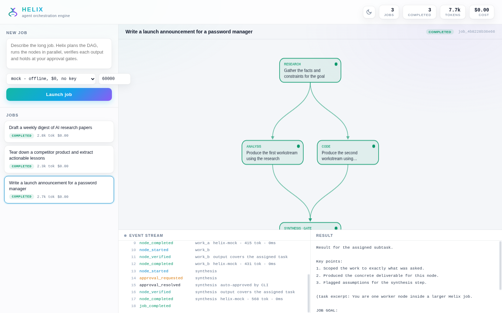
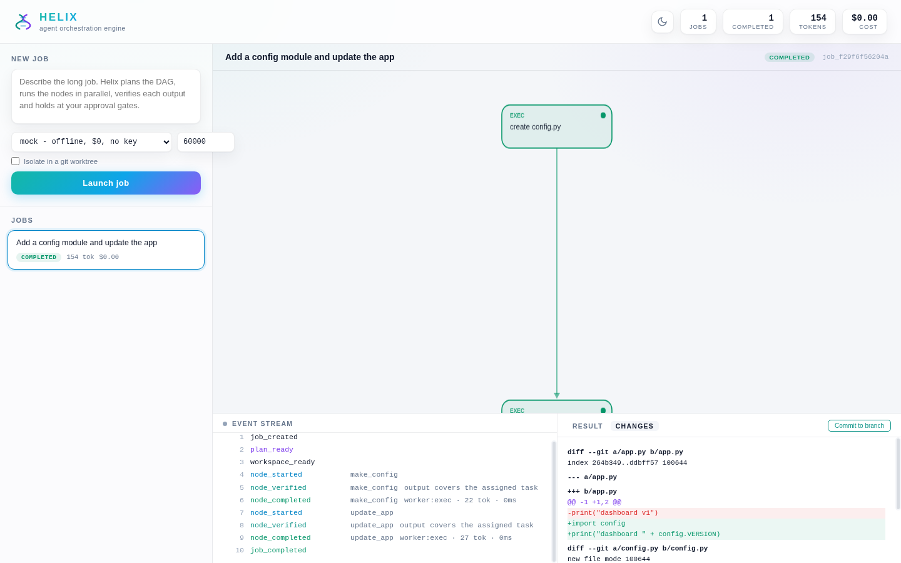
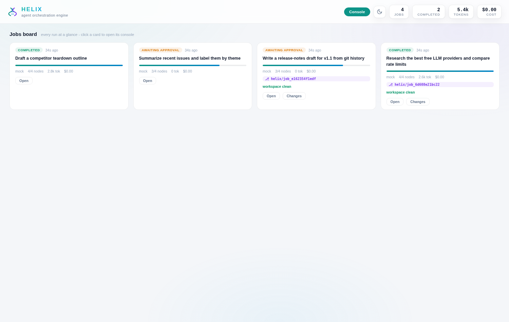
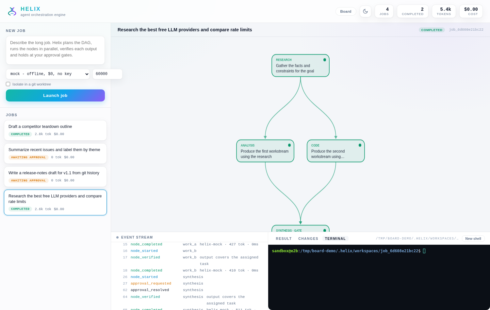

<div align="center">


<p align="center">
  
</p>


**One goal in. A validated plan, parallel workers, verified output, and a bill you can read.**

`pip install` to first finished job in under a minute · runs end to end at **$0** on free models · every number on this page is reproducible with the harness in this repo

</div>

---

# What is Helix

Helix is a standalone orchestration engine for jobs too long for one agent session. Give it a goal; it plans a typed DAG, runs independent nodes in parallel, verifies every node output, holds at human approval gates you place, and returns one synthesized result - with the full event log, token count and cost recorded for every step.

It is an engine, not a skill file and not a pile of API calls. State lives in SQLite, so a job survives the session that started it: submit from a coding agent, watch it in the dashboard, approve the gate from your phone, collect the result an hour later.

## Why not just use a bigger framework

| Axis | The heavyweight approach | Helix |
| --- | --- | --- |
| Cost to run | best numbers need paid flagship models | full pipeline on recurring **free tiers**; mock mode needs no key at all |
| Plan quality | benchmark scores published as screenshots | a typed DAG schema, a validator, and a scorer (Node F1 / Edge F1 / partial order / exact match) you can rerun |
| Footprint | ~800k lines, Docker, multiple services | one package, one SQLite file, ~5k lines |
| Reproducibility | trust the PNG | `helix export` gives you the plan, every event and the result as JSON |

## Three ways in

**1. A skill for your coding agent.** Drop [`skill/SKILL.md`](skill/SKILL.md) into Claude Code or Codex. It teaches the agent when a job is too long for the session and how to hand it to Helix, then collect the result. The skill is the entry point; the engine does the orchestration and keeps the job alive after the session ends.

**2. The CLI.** Plan, run, watch and approve from any terminal. Any agent that can run shell commands can drive Helix this way.

```bash
pip install -e .
helix run "Research tide-prediction competitors and draft a launch plan" --provider gemini --auto-approve
helix jobs
helix status job_9f2... --full
helix approve job_9f2... synthesis
```

**3. The API + dashboard.** Teams submit jobs from their apps and watch progress, approvals, tokens and cost live.

```bash
helix serve --port 8741
# open http://localhost:8741
```

```
POST /api/jobs                  { "goal": "...", "provider": "gemini", "budget": 60000 }
GET  /api/jobs/{id}             job, plan, metrics
GET  /api/jobs/{id}/stream      live SSE event stream
POST /api/jobs/{id}/approve     { "node_id": "synthesis", "approved": true }
GET  /api/stats                 fleet totals
GET  /.well-known/agent.json    agent card (A2A-style discovery)
POST /a2a                       peer task submission
```

## What a run looks like

```
goal
  └─ planner (cheap model, JSON only)
       └─ validate ── fail? ── one repair pass with the exact errors
            └─ level 1: research ──────────────┐
                 level 2: work_a ∥ work_b       │ parallel, retries, verifier
                 level 3: synthesis  ○ approval gate
                   └─ result + event log + tokens + cost
```

Every node output passes a cheap verifier call before downstream nodes see it. A node that fails verification retries; a node that fails twice fails the job loudly, not silently. The token budget is a hard ceiling: when it is spent, the job stops at `budget_exceeded` with the partial log intact.

## Models: everything, free first

All providers are one OpenAI-compatible router away (Anthropic uses its Messages API); pick per run with `--provider` or `HELIX_PROVIDER`.

| Provider | Tier | Key env | Notes |
| --- | --- | --- | --- |
| `mock` | free | - | offline deterministic provider; demos, tests, CI - no key |
| `gemini` | free | `GEMINI_API_KEY` | Google AI Studio free tier (recurring) |
| `groq` | free | `GROQ_API_KEY` | recurring free tier, rate-limited |
| `openrouter` | free | `OPENROUTER_API_KEY` | `:free` model variants |
| `cerebras` | free | `CEREBRAS_API_KEY` | recurring free tier |
| `ollama` | free | - | local models, fully offline |
| `openai` | paid | `OPENAI_API_KEY` | |
| `anthropic` | paid | `ANTHROPIC_API_KEY` | Messages API |
| `deepseek` | paid | `DEEPSEEK_API_KEY` | low cost |
| `mistral` | paid | `MISTRAL_API_KEY` | |
| `together` | paid | `TOGETHER_API_KEY` | |
| `custom` | ? | `HELIX_API_KEY` | any OpenAI-compatible endpoint via `HELIX_API_BASE` |

Swap models without touching code: `HELIX_MODEL`, `HELIX_MODEL_CHEAP`, `HELIX_MODEL_STRONG`. The cost meter uses a per-provider estimate you can correct with `HELIX_COST_PER_1K`.

Cheap nodes run on the cheap model; synthesis and hard code nodes escalate to the strong model, and only after a verifier failure. That routing is where the $0 result comes from.

## Workers: Claude Code, Codex and friends

The preset registry covers claude-code, codex, gemini-cli, aider, goose and opencode out of the box, plus `http` and `custom` escape hatches. MCP server configs are managed with `helix mcp add-server/list/remove` and passed through to workers automatically (claude-code gets `--mcp-config`; every worker gets `HELIX_MCP_CONFIG`).

A DAG node with `kind: "agent"` hands its subtask to an external coding agent instead of a plain model call:

```json
{ "id": "builder", "kind": "agent", "worker": "claude-code",
  "task": "Implement the landing page in ./site from the research above",
  "depends_on": ["research"] }
```

| Worker | How it runs |
| --- | --- |
| `claude-code` | `claude -p` headless mode |
| `codex` | `codex exec` non-interactive |
| `custom` | any CLI template: `HELIX_WORKER_CMD="my-agent run --task {prompt}"` |
| `http` | any remote OpenAI-compatible agent: `HELIX_WORKER_URL`, `HELIX_WORKER_KEY`, `HELIX_WORKER_MODEL` |

Worker output goes through the same verifier, retries and approval gates as any model call. If the CLI is missing, the node fails with a clear message instead of hanging.

## Sandboxed exec nodes

A node with `kind: "exec"` runs a shell command instead of a model call - builds, tests, lint, data pulls. Commands must pass the `HELIX_EXEC_ALLOW` prefix allowlist (default: python3, pip, node, npm, pytest, cat, ls, echo, grep, find, jq, curl, git status/diff/log). Everything else is blocked before it starts, and the command plus output lands in the event log.

```json
{ "id": "tests", "kind": "exec", "command": "pytest -q", "depends_on": ["builder"] }
```

## Worktree workspaces: every coding job on its own branch

Run a coding job inside its own git worktree and nothing touches your checkout until you say so:

```bash
helix run "add rate limiting to the api" --worktree --provider gemini
helix diff <job_id>          # review exactly what it changed
helix commit <job_id>        # commit to the helix/<job_id> branch
git merge helix/<job_id>     # your call, your merge
```

Exec and agent nodes run with the worktree as their working directory; the dashboard's Changes tab renders the diff with a Commit button.

<p align="center">
  
</p>

### Jobs board

Running several jobs at once? The dashboard's Board view (`?board=1` or the Board button in the header) shows every run as a live card: status, node progress, provider, tokens, cost, worktree branch and its diff stat. Open a card's console, review its changes in a modal, or commit its branch without leaving the board.

<p align="center">
  
</p>

### Embedded terminals

Every job has a Terminal tab: a real shell (PTY on Linux/macOS, pywinpty on Windows) opened in the job's worktree - or the server directory for jobs without one - right in the dashboard. Inspect what the agent did, run follow-up commands, or debug a failed node without leaving the browser. Sessions survive tab switches and reconnects, and idle shells are reaped automatically.

<p align="center">
  
</p> Non-git projects get a private workspace directory instead. Add `.helix/` to your global gitignore or let Helix mark it excluded automatically.

## Memory, playbooks, schedules

Helix remembers what it learns. Every completed node writes a short learning to a markdown memory store (`memory/LEARNINGS.md` next to the database), and both the planner and each node prompt recall the entries relevant to the current goal - so the tenth run of a workflow is smarter than the first. Inspect it with `helix memory`, query it with `helix memory --recall "<topic>"`, add your own with `helix memory --add "..."`, or turn it off per run with `--no-memory`.

Playbooks are named, reusable plans: `helix playbook save weekly-review --goal "Summarize the week in tech news"` plans once and stores the validated DAG; `helix playbook run weekly-review` executes it with zero re-planning cost. Playbooks are plain JSON files - commit them, review them, share them.

Schedules run goals or playbooks on a cron: `helix schedule add morning-brief --cron "30 8 * * 1-5" --playbook weekly-review`, then `helix schedule daemon` fires them through the normal runner - same event log, gates, memory and budgets as interactive runs.

## Templates, webhooks, hooks

Four prebuilt plan templates ship in the box (`helix templates`): research-report, code-change, weekly-digest and competitor-teardown. Turn one into a named playbook with `helix playbook save my-teardown --template competitor-teardown`, then run or schedule it.

Inbound webhooks let any external system fire a goal or playbook: `helix webhook add deploy --playbook ship-it` prints a tokenized URL; a plain `POST /api/hooks/<token>` queues the job and returns its id. `helix webhook list` shows every hook.

Outbound hooks are a directory, not a framework: drop an executable named after an event type (`node_completed`, `plan_ready`, or `all` for everything) into `hooks/` next to the database and it runs with the event JSON on stdin, best-effort, never blocking the job. Any language, no SDK.

## The eval harness

`helix plan "<goal>"` prints the validated DAG for any goal without executing it. `helix eval` runs the planner against the reference decompositions in `examples/gold_plans.json` and grades it on Node F1, Edge F1, partial-order accuracy and exact match - the metrics that matter for orchestration. Add your own goals to the gold file, rerun, publish the output with the raw trajectories. That is the whole reproducibility story: no screenshots of charts, just a command anyone can run.

## Configuration

| Env | Default | What it does |
| --- | --- | --- |
| `HELIX_PROVIDER` | `mock` | provider for CLI runs |
| `HELIX_DB` | `~/.helix/helix.db` | SQLite state file |
| `HELIX_MODEL` / `_CHEAP` / `_STRONG` | per provider | override model choices |
| `HELIX_API_BASE` | per provider | override endpoint |
| `HELIX_COST_PER_1K` | per provider | correct the cost estimate |
| `HELIX_EXEC_ALLOW` | conservative defaults | command allowlist for exec nodes |

## Development

```bash
pip install -e .[dev]
pytest
```

Apache 2.0. Built independently - the orchestration pattern is old and shared; every line of code, wording and visual here is original.
